## 闯关任务

### ***完成SSH连接***

首先把自己电脑下的公钥复制过去，进行免密连接（位置一般是在C:\Users\\Your_user_name\\.ssh）

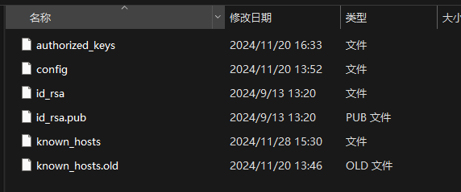

然后打开pycharm的tools\deployment\Configuration

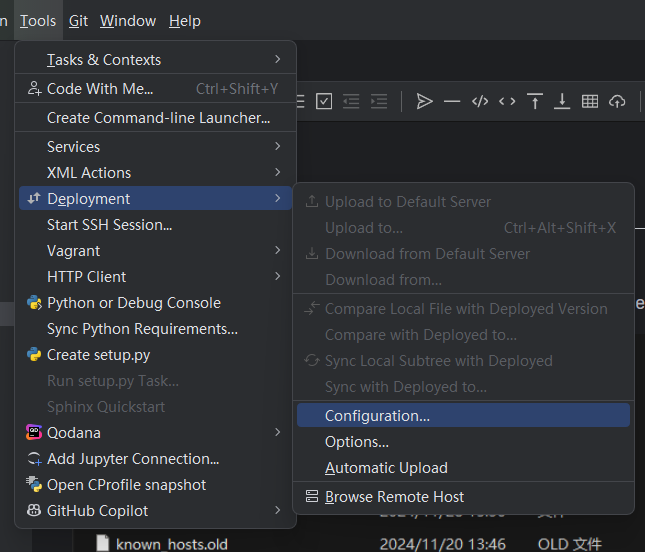

对SSH configuration进行如下配置，端口号port填上InternStudio给的port号。

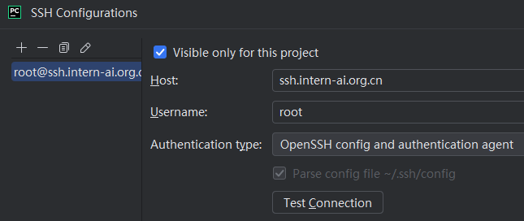

检查连接情况，没问题，连接成功即可。

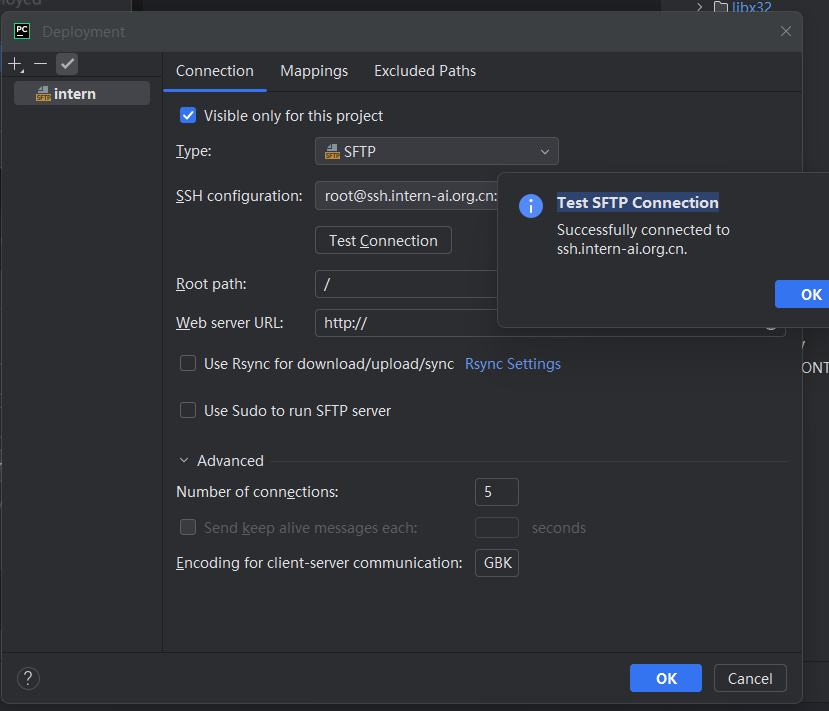

### ***端口映射***

先使用`pip install gradio==4.29.0`命令安装依赖包，然后在本地终端打开端口映射

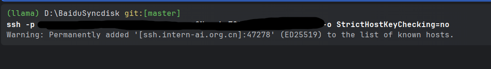

然后再打开hello_world.py中的url

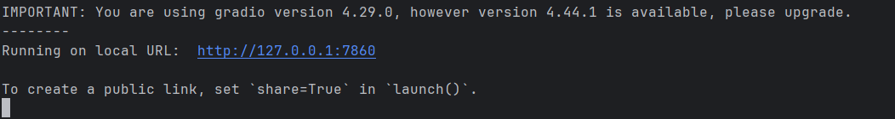

可见打开的浏览器web demo如下：

### ***Linux基础命令***

1. touch/mkdir/cd/pwd

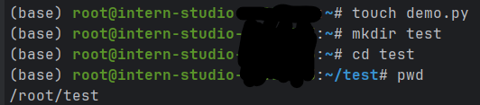

2. cat

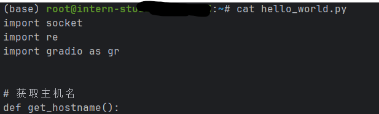

3. vi or vim

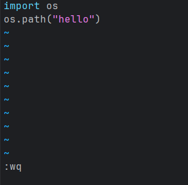

4. cp and ln

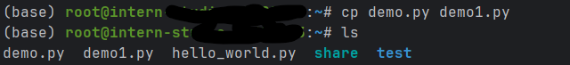

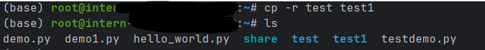

5. mv and rm

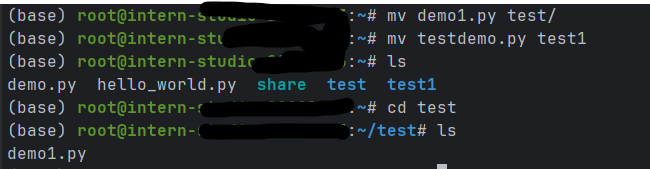

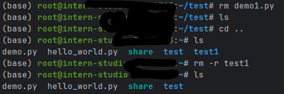

5. find

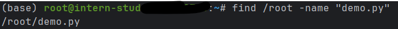
